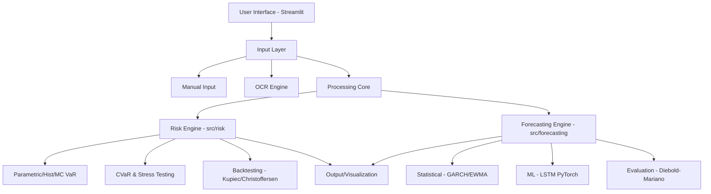

# 📊 RiskLens: Portfolio Risk Analysis & Volatility Forecasting

RiskLens is a quantitative finance framework designed to provide deep insights into investment portfolio risk. It combines traditional econometric models with modern deep learning to forecast market volatility and estimate potential losses through various Value-at-Risk (VaR) methodologies.

## 🚀 Key Features

- **Smart Portfolio Input:** 
  - Manual entry of asset symbols and quantities.
  - **OCR Integration:** Upload screenshots of your holdings to automatically extract portfolio data.
- **Comprehensive Risk Metrics:**
  - **VaR (Value at Risk):** Parametric, Historical, and Monte Carlo simulations.
  - **CVaR (Conditional VaR):** Analysis of expected shortfall during extreme market events.
  - **Stress Testing:** Scenario-based analysis to simulate market shocks.
- **Hybrid Volatility Forecasting:**
  - **Statistical Models:** EWMA and GARCH for time-series volatility.
  - **Deep Learning:** LSTM (Long Short-Term Memory) networks for non-linear pattern recognition.
- **Model Validation:**
  - Rigorous backtesting using **Kupiec** and **Christoffersen** tests.
  - Model comparison using the **Diebold-Mariano** statistical test.

---

## 🏗 Architecture

The project follows a modular design to separate data acquisition, mathematical computation, and user presentation.



### Component Breakdown:
- **`app.py`**: The orchestration layer. Handles the Streamlit UI and manages session state for the portfolio.
- **`src/input/`**: Responsible for transforming raw user input (text or images) into a standardized `Portfolio` object.
- **`src/risk/`**: A library of quantitative risk functions. It calculates the probability of loss and validates those probabilities against historical data.
- **`src/forecasting/`**: A comparative engine that trains and evaluates different volatility models to predict future risk.

---

## 🔑 Important Technical Details

### 1. The Risk Pipeline
The system doesn't just calculate a number; it validates it. The flow is:
`Portfolio Data` $\rightarrow$ `VaR Calculation` $\rightarrow$ `Backtesting` $\rightarrow$ `Confidence Score`.

### 2. The Forecasting Competition
RiskLens implements a "competition" between models. By running GARCH and LSTM side-by-side and using the Diebold-Mariano test, the system can determine which model is more reliable for a specific asset's behavior.

### 3. Tech Stack
- **Language:** Python 3.x
- **UI:** Streamlit
- **Quant:** `arch` (GARCH), `statsmodels`, `scipy`, `pandas`
- **Deep Learning:** `PyTorch` (for LSTM)
- **Testing:** `pytest`

---

## 🛠 Installation & Usage

### Setup
1. Clone the repository.
2. Create a virtual environment:
   ```bash
   python -m venv .venv
   source .venv/bin/activate  # Linux/Mac
   .venv\Scripts\activate     # Windows
   ```
3. Install dependencies:
   ```bash
   pip install -r requirements.txt
   ```

### Running the App
```bash
streamlit run app.py
```

### Running Research Scripts
The project includes several standalone scripts for OOS (Out-of-Sample) diagnostics:
- `run_garch_oos.py`: Evaluate GARCH performance.
- `train_lstm.py`: Train the deep learning volatility model.
- `run_baseline_oos.py`: Run baseline risk comparisons.
